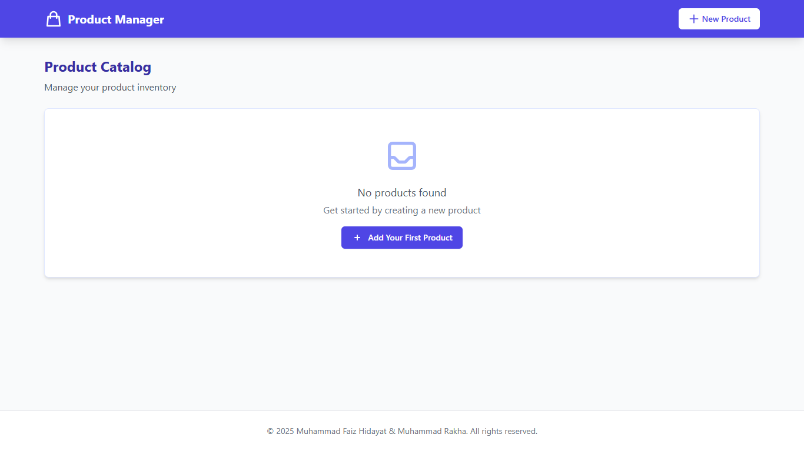

# Product Management App

A simple Laravel-based product management system with a clean, responsive UI powered by Tailwind CSS.



## Features

-   **Complete CRUD Operations**

    -   Create new products
    -   View a list of all products
    -   Update existing products
    -   Delete products with confirmation

-   **User-Friendly Interface**

    -   Responsive design that works on mobile and desktop
    -   Clean, modern UI with Tailwind CSS
    -   Interactive elements with Alpine.js
    -   Smooth animations and transitions

-   **Data Management**
    -   MySQL database integration
    -   Form validation for data integrity
    -   Indonesian Rupiah (Rp) currency formatting

## Technologies Used

-   **Backend**: Laravel 10.x
-   **Frontend**: Tailwind CSS 3.x, Alpine.js
-   **Database**: MySQL
-   **Environment**: PHP 8.1

## Installation

1. Clone the repository

    ```bash
    git clone https://github.com/yourusername/product-management-app.git
    cd product-management-app
    ```

2. Install PHP dependencies

    ```bash
    composer install
    ```

3. Install NPM dependencies

    ```bash
    npm install
    ```

4. Create a copy of the .env file

    ```bash
    cp .env.example .env
    ```

5. Generate application key

    ```bash
    php artisan key:generate
    ```

6. Configure your database in the .env file

    ```
    DB_CONNECTION=mysql
    DB_HOST=127.0.0.1
    DB_PORT=3306
    DB_DATABASE=product_app
    DB_USERNAME=your_username
    DB_PASSWORD=your_password
    ```

7. Run database migrations

    ```bash
    php artisan migrate
    ```

8. Compile assets

    ```bash
    npm run dev
    ```

9. Start the development server

    ```bash
    php artisan serve
    ```

10. Visit http://localhost:8000 in your browser

## Usage

-   **Viewing Products**: The home page shows a list of all products with their details
-   **Adding Products**: Click "New Product" in the navigation bar to create a new product
-   **Editing Products**: Click the "Edit" button next to any product to modify its details
-   **Deleting Products**: Click the "Delete" button and confirm in the modal to remove a product

## Project Structure

```
product-app/
├── app/
│   ├── Http/Controllers/
│   │   └── ProductController.php
│   └── Models/
│       └── Product.php
├── database/
│   └── migrations/
│       └── xxxx_xx_xx_xxxxxx_create_products_table.php
├── resources/
│   └── views/
│       ├── layouts/
│       │   └── app.blade.php
│       └── products/
│           ├── index.blade.php
│           ├── create.blade.php
│           └── edit.blade.php
└── routes/
    └── web.php
```

## License

[MIT License](LICENSE)

## Authors

-   Muhammad Faiz Hidayat

## Acknowledgments

-   Laravel Team for the excellent framework
-   Tailwind CSS for the utility-first styling
-   Alpine.js for the lightweight interactivity
